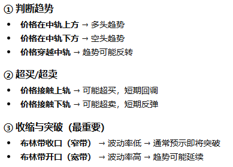
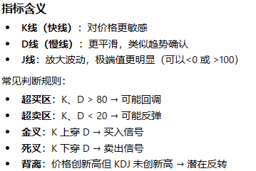
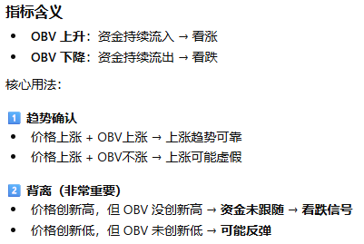

## 量价数据指标的特征工程

[TOC]

通常我们可以通过 pandas-ta, 或者 talib 库来构造主观的量价数据指标，由于后者更贴合生产环境，因此如下代码和演示均使用talib. 

### 趋势指标: SMA(简单移动平均)

该指标反应价格的趋势移动，即股票当前收盘价至往前$N$天的等权平均，其数学计算公式为:
$$
SMA_t = \frac{1}{N}\sum_{i=0}^{N-1} \text{Close}_{t-i}
$$
该指标代表了价格平均走势，我们熟悉的例如海龟交易法即基于这类指标来构建信号，参数$N$越大越能体现价格水平，但灵敏度越差，即对短期价格变化不敏感. 

```python
class ta.trend.SMAIndicator(close: pandas.core.series.Series, window: int, fillna: bool = False)
```

### 趋势指标: MACD(指数平滑异动移动平均)

该指标衡量短期价格趋势与长期趋势的差异, 可以帮助我们判断趋势的变化，其数学公式为(其中EMA代表指数移动平均函数):
$$
MACD = EMA_{fast} - EMA_{slow}\\
Signal = EMA_{signal}(MACD) \\
Hist = MACD - Signal
$$
通常，我们取参数$fast=12, slow=26, signal=9$，其中$EMA_{fast}， EMA_{slow}$ 分别被称为快线和慢线. 若以MACD指标作为规则交易, 还需要参考Hist即柱状图, 具体指标含义参考如下:

 

```python
class ta.trend.MACD(close: pandas.core.series.Series, window_slow: int = 26, window_fast: int = 12, window_sign: int = 9, fillna: bool = False)
```

### 波动指标: BOLL(布林带)

该指标包含三条均线，其分别上包裹，穿插，下包裹价格线. 主要用于衡量价格波动范围，和判断超买超卖. 其数学公式为:
$$
MB=SMA_N\\
UB= MB + k\cdot \sigma_N \\
LB = MB - k \cdot \sigma_N
$$
通常我们取$k=1$, 约$95\%$的价格会波动在上下轨$UB,LB$, 其中$\sigma_N$代表$N$日价格标准差. 具体指标含义参考如下:



```python
class ta.volatility.BollingerBands(close: pandas.core.series.Series, window: int = 20, window_dev: int = 2, fillna: bool = False)
```

### 动量指标: RSI(相对强弱指数)

该指标为一条值域为$[0,100]$的曲线，其比较“上涨的力度”和“下跌的力度”，判断市场是否过热(超买)或过冷(超卖). 首先计算价格变化:
$$
\Delta P_t=\text{Close}_t - \text{Close}_{t-1} \\
$$
随后拆分涨跌序列，并求涨跌中的最大值:
$$
\text{Gain}=\max(\Delta P,0)\\
\text{Loss}=\max(-\Delta P,0) 
$$
随后计算平均涨跌幅度, $N$一般取$14$:
$$
\text{Gain}_{avg}=EMA(\text{Gain},N)\\
\text{Loss}_{avg}=EMA(\text{Loss},N)
$$
最后通过计算相对强度RS来得到RSI指标:
$$
RS = \frac{\text{Gain}_{avg}}{\text{Loss}_{avg}} \\
RSI=100-\frac{100}{1+RS}
$$
其中我们认为当$RSI>70$ 市场可能超买面临下跌，而当$RSI<30$ 市场可能超卖面临反弹, 而$50$为多空优势判断分水岭. 除此之外，该指标还可用于判断背离，即当价格创新高而$RSI$逆势移动时价格可能面临下跌风险.

```python
class ta.momentum.RSIIndicator(close: pandas.core.series.Series, window: int = 14, fillna: bool = False)
```

### 动量指标: KDJ(随机指标)

该指标是由经典的随机指标 (Stochastic Oscillator) 演化而来，用于衡量价格在一定周期内的位置，从而判断超买/超卖状态以及趋势反转, 指标反应当前价格在最近一段时间价格区间中的相对位置. 首先定义周期内最高价和最低价:
$$
H_n = \max(\text{High}_{t-n+1},\cdots,\text{High}_t) \\
L_n = \min(\text{Low}_{t-n+1},\cdots,\text{Low}_t)
$$
随后计算RSV(未成熟随机值)，并通过平滑得到KDJ:
$$
RSV_t = \frac{\text{Close}_t-L_n}{H_n-L_n}\times 100\\
K_t = \frac{2}{3}K_{t-1}+\frac{1}{3}RSV_t\\
D_t = \frac{2}{3}D_{t-1}+\frac{1}{3}K_t \\
J_t = 3K_t-2D_t
$$
其指标含义参考如下:



```python
class ta.momentum.StochasticOscillator(high: pandas.core.series.Series, low: pandas.core.series.Series, close: pandas.core.series.Series, window: int = 14, smooth_window: int = 3, fillna: bool = False)
```

### 成交量指标: OBV(能量潮)

该指标是一个量价结合指标，通过成交量的累积变化来判断资金流入/流出. 其核心思想为: 价格上涨时的成交量视为“资金流入”，下跌时视为“资金流出”. 数学公式如下:
$$
OBV_t = \left\{ \begin{array}
 &OBV_{t-1}+\text{Volume}_t, &\text{if }\text{Close}_t > \text{Close}_{t-1}\\
 OBV_{t-1}-\text{Volume}_t, &\text{if }\text{Close}_t < \text{Close}_{t-1}\\
 OBV_{t-1}, &\text{otherwise}
\end{array} \right.
$$
其指标含义参考如下:



```python
class ta.volume.OnBalanceVolumeIndicator(close: pandas.core.series.Series, volume: pandas.core.series.Series, fillna: bool = False)
```

