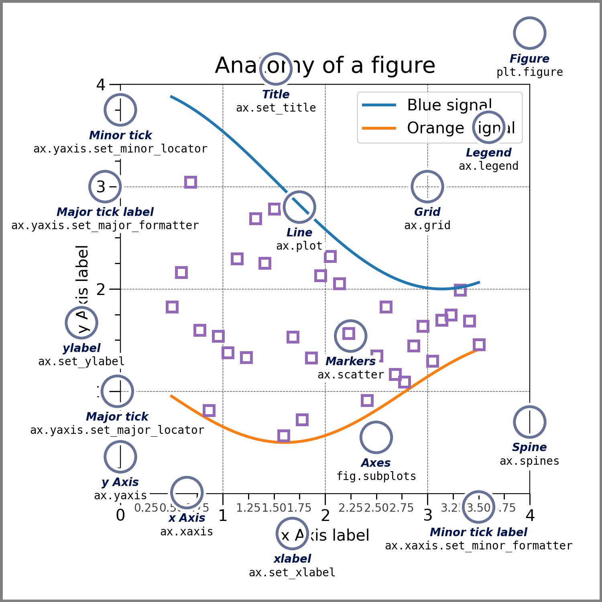

## 数据和指标的可视化

本节将会使用matplotlib, mplfinance, plotly 库分别实现不同需求下的K线和技术指标的可视化. 其中matplotlib是Python最常用的可视化模块，mplfinance更多用于OHLC的K线绘制，而plotly是Web开发中的可视化插件. 

- ### Matplotlib

  matplotlib 的核心是一个分层对象模型，从低到高分别有 figure(画布), axes(子图), axis(坐标轴)，其中figure是最外层容器可以包含多个子图, 而我们主要编辑axes对象，axis是axes的封装对象，一般在开发中不过多涉及. 对于简单使用可以直接调用 `matplotlib.pyplot` 下的各类绘图函数例如 `plot()`, 具体参考文档 [Matplotlib](https://matplotlib.org/stable/)：

  ```python
  matplotlib.pyplot.plot(*args, scalex=True, scaley=True, data=None, **kwargs)
  ```

  对于多子图的需求，更多的是显性声明figure, axes对象，子图的声明主要有两种方式:

  ```python
  fig, ax = matplotlib.pyplot.subplots(nrows=1, ncols=1) # 1x1的画布
  fig.add_subplots(111) # 添加第一行第一列第一个图
  ```

  axes变量为子图的对象数组. 绘制收盘价，SMA折线和交易量柱状图的多子图画布的代码如下: 

  ```python
  _, axes = plt.subplots(2,1)
  axes[0].plot(df["Date"],df["Close"],label="Price")
  axes[0].plot(df["Date"],df["SMA_7"],label="SMA(7)")
  axes[1].bar(df["Date"],df["Volume"])
  ```

  当然，axes对象除了内容外还有其他重要的组件，例如标题，图例，坐标轴等，具体如下图所示:

  

- ### Mplfinance

  Mplfinance是Matplotlib库的封装，主要用于绘制不同种类的K线. 其和Matplotlib的对象结构几乎一致, 具体查看开源项目仓库 [Mplfinance](https://github.com/matplotlib/mplfinance). 绘制K线代码如下:

  ```python
  mpf.plot(df,type='candle',volume=True)
  ```

  其中K线数据帧的列名必须严格为`Open`, `High`, `Low`, `Close`, `Volume`, type参数支持candle(蜡烛图), line(折线)等, volume参数指定绘制交易量柱状图. 多子图绘制中，使用make_addplot()函数，以绘制K线和OBV为例，在开发中通常写成:

  ```python
  sma_plots = [
          mpf.make_addplot(df["SMA_7"], label="SMA(7)", panel=0, width=1),
      ]
  
  obv_plots = [
          mpf.make_addplot(df["OBV"], label="OBV", panel=2, width=1),
      ]
  
  fig, axes = mpf.plot(df, type="candle", volume=True, volume_panel=1, addplot=sma_plots+obv_plots, style="yahoo")
  ```

  这里包含三个axes子图，panel指定了子图的位置(从上到下)，分别为K线和SMA图，交易量图，OBV图. 同样，我们也可以通过axes对象直接访问子图.

  ```python
  axes[0].plot(df.index, df["SMA_30"])
  ```

- ### Plotly

  Plotly常用于web开发，对于Python web开发的具体细节这里不过多阐述, 大致原理为添加一个类似于Timer的元素定时调用回调函数，回调函数中更新K线图:

  ```
  dcc.Interval(id='interval', interval=2000, n_intervals=0)
  ......
  
  @app.callback(
      Output("live-candlestick", "figure"),
      Input("interval", "n_intervals")
  )
  def update_chart(n):
    ......
  ```

  对于绘制K线图，Plotly 的对象结构同前两位类似，仅仅是函数封装细节不同，首先构造Figure对象，若需要子图调用add_trace函数. 函数原型如下:

  ```python
  class plotly.graph_objects.Figure(data=None, layout=None, frames=None, skip_invalid=False, **kwargs)
  
  add_trace(trace, row=None, col=None, secondary_y=None, exclude_empty_subplots=False) → plotly.graph_objects._figure.Figure
  ```

  

