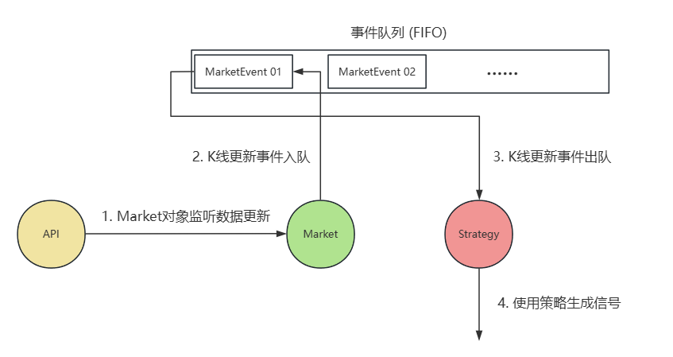

## 规则类交易策略和交易信号的实现

[TOC]

### 脚本驱动实现

对于简单策略的信号生成，可以使用向量方法，即一次性直接对DataFrame对象计算信号，通常能够在几行内实现. 例如:

```python
df["signal"] = np.where(df["SMA_7"] > df["SMA_30"], 1, -1)
```

而现实是，规则类交易通常包含多个条件判断，`script-driven.py` 中定义了一个稍微复杂一点的假策略: 当K线连续两天涨/跌，分别生成买/卖信号. 实现该策略并未涉及新知识，关键是掌握Pandas和Numpy模块的封装函数，同时脚本驱动方法并不适合生产级环境.

### 事件驱动实现

事件驱动方法旨在当"事件"触发时，程序自动处理. 将写死的脚本逻辑替换为事件，例如当K线更新时计算指标和信号，触发信号事件时买入卖出. `event-driven.py` 的结构大致如下: 



事件队列的实现多样，可以依据需求选择，例如queue模块等，这里使用collections模块的deque类因为其可以同时实现FIFO和LIFO. 常用函数如下 (参考文档: [Python3 collections](https://docs.python.org/3/library/collections.html)): 

| 函数         | 说明                             |
| ------------ | -------------------------------- |
| append()     | 在右边添加元素（队尾）           |
| appendleft() | 在左边添加元素（队头）           |
| pop()        | 删除并返回右边元素（栈顶，LIFO） |
| popleft()    | 删除并返回左边元素（队头，FIFO） |

该文件中实现了一个简单的策略: 当SMA7日均线穿过30日均线买入，反之卖出. 而对于事件类的封装，每个对象(Market, Strategy)在未来应该包含一个事件类(MarketEvent等) 用于定义不同的事件从而有不同的响应的行为. 同时所有事件类应当有合理的继承关系，文件中MarketEvent继承自Event.  